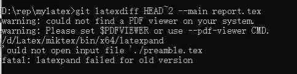

# FLIP(00) FAQ

Hi everyone, this is a FAQ document about FLIP (00).  This is also a document that encourages everyone to update questions and good answers.

由于FLIP(00)的考核重点是 *LaTex* 和 *Git* 的掌握和熟练运用，下面总结了一些比较常见的 *LaTex* 和 *Git* 使用方面的问题。希望大家在学习的过程中多做参考，同时也鼓励大家在此文件上及时更新自己所遇到的问题或者给别人遇到的问题提供解决方案。当然，一切都要采用issues和pull request的形式，这也是考核的一项重要的考核标准。

**1.** *GitFlow*  和 *LaTexDiff* 的操作流程

建议自己寻找资料学习操作流程，*GitFlow*和*LaTexDiff*是比较基本的工具，多练习几遍就可以掌握。

提供参考[blog 1](https://www.tulip.academy/blog/workflow-latex)。

**2.** *Git LaTexDiff* 生成的文档不能显示*GitInfo*信息？

> 我的poster已经弄出来了，是一个比较意外的bug导致的生成失败。具体来说，是poster模板里不能在数学环境/文件路径之外的地方出现下划线_。在report和slide里都没有这个问题，所以一直没想到。
>
> （Answer by 周佳绘）

**3.** *Tex* 编辑器是不是不能共存在系统变量的路径上?

只需要选择一个适合的 *Tex* 编辑器即可，不需要安装多个编辑器。一般来说，首先，为了搭建 *LaTeX* 工作环境，你需要安装：

- *TeX Live* 或者 *MiKTeX* 
- *Visual Studio Code*
- *LaTeX Workshop （VS Code 插件）*

安装和配置 tex 推荐 blog [1](https://www.latexstudio.net/archives/12260.html ),[2](https://www.cnblogs.com/1625--H/p/11524968.html )和[3](http://www.wenxingsen.com/blog/blogdetail.php?pageid=524 )。

**4.** *LaTexDiff* 形成不了差异文件？

> 把功能分支完成（merge到develop分支），然后推送更改到远程仓库，这样以后*LaTexDiff* 显示正常。（Answer by 徐荣欣）

**5.** 为什么直接用 *TexStudio* 编译，*GitInfo* 是有效的。但使用 *Git LatexDiff* 生成的差异文档，*GitInfo* 不生效？

解决方法 by [周佳绘](https://www.tulip.academy/blog/filp00 )。

**6.** 使用 *TexStudio+TexLive* 编译 *Slides* 会出现编译不出来的情况?

可能是编译命令没有设置好的问题，如编译slides命令需要设置为：

*user0: LaTex.DVIPS.PS2PDF*

*latex --synctex=1 -interaction=nonstopmode --shell-escape %.tex | dvips -o %.ps %.dvi| ps2pdf %.ps*

      

**7.** *LaTexDiff*生成差异文件一直报错（如下图所示）？

      

解决方案很简单，就是按照上面的提示，在原有的命令上加 *--pdf-viewer CMD*

**8.** *VS code*无法编译slides

配置文件需要*VS code*调整。参考[配置文件](https://shimo.im/docs/9rTC6VTJ9VgCvw3W/ )，或者是）00组钉钉群文件。
**9.** *latexdiff*无法比较两个tex文件差异
两个tex文件尽量不要包含表格，标题，尤其是图片。最好只是纯文档之间的比较。

**9.** *Latex*编译slides失败，提示
*! LaTeX Error: File xxx.sty not found*

即使用模板时，缺少宏包

1.需要到[ctan.org](https://ctan.org/pkg)下载相应的宏包，并解压到Latex的安装目录（如D:\software\texlive\texmf-local\tex\latex）。

2.在cmd窗口使用*mktexlsr*命令更新即可。

**8.** *VS code*编译*poster*或*report*的时候，报错*Can be used only in preamble*

非*poster*或*report*编译，出现这种问题的原因是：

1. 在正文中引入了某个包或者类，而不是在序言（preamble）中，那么就会发生这个错误（在命令 \begin{document} 之前的内容，都被称为序言）。可以将引入的包或者类放在\begin{document}之前

*poster*或*report*编译，出现这种问题的原因是：

使用了错误的编译命令，在编译*poster*和*report*的时候，你需要使用*latexmk -pdf*工具，也就是说你应该选择*mk pdf*按键来生成。此外在生成slides的时候，应该使用的命令是*"latex", "dvips", "ps2pdf"*.

**9.** *overleaf*上面编译*slides*报错：

需要将overleaf的编译器设置为*LaTeX*（Answer by 张宝杰）
